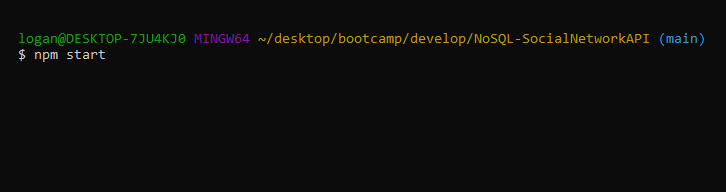
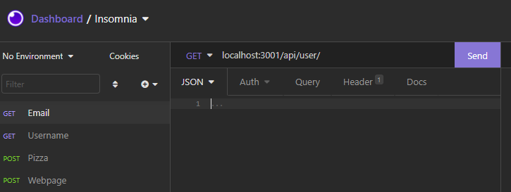

## Challenge Eighteen NoSQL-SocialNetworkAPI

### Description

In a previous challenge, we set up the back end for a site using a SQL database. For this challenge, we were tasked with doing something simmilar but using a NoSQL database approach using MongoDB and Mongoose. This allowed for a more fluid setup when it came to the Models, which was something I enjoyed. One thing I struggled more with during the SQL database challenge was making sure all of the parent/child and foreign key relationships were in order. This NoSQL method came easier to me. 

Likewise adjusting to Mongoose syntax was a fairly easy process and it helped to be able to logically think through how each method was working.

### Screenshots

To invoke the server type npm start into your command line

Then you will be able to access your API endpoints through Insomnia at your designated local host

### Links
Github: [Link](https://github.com/LoganDufek/NoSQL-SocialNetworkAPI)
YouTube: [Link](https://www.youtube.com/watch?v=Y0awgm7dbig)